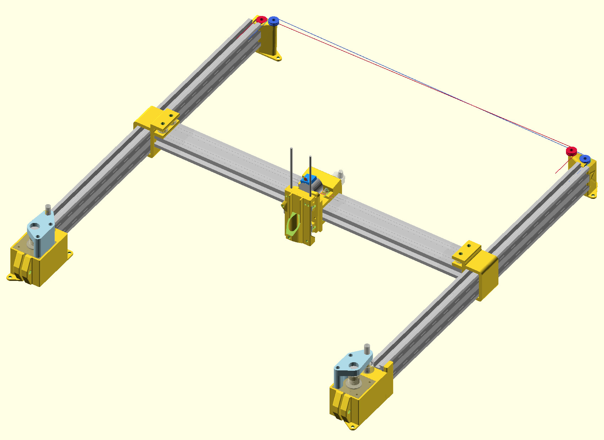

# A corexy plotter with the goal of large size and decent precision

Not quite ready for primetime, .stl files are not yet usable.

## Building
Install openscad, and build with `make -j4`

To build the simpler version that is more tested: `make -j4 simpler`
